# Chess Game
 > Your author list below should include links to all members GitHub and should begin with a "\<" (remove existing author).
 
 > Authors: \<[Shinjin Santhakumar](https://github.com/shinjin-santhakumar),[Alan Chau](https://github.com/achau6),[James Sowell](https://github.com/JamesSowell)\>
 
 > You will be forming a group of **THREE** students and work on an interesting project that you will propose yourself (in this `README.md` document). You can pick any project that you'd like, but it needs ot implement three design patterns. Each of the members in a group is expected to work on at least one design pattern and its test cases. You can, of course, help each other, but it needs to be clear who will be responsible for which pattern and for which general project features.
 
 > ## Expectations
 > * Incorporate **three** distinct design patterns, *two* of the design patterns need to be taught in this course:
 >   * Composite, Strategy, Abstract Factory, Visitor
 > * All three design patterns need to be linked together (it can't be three distinct projects)
 > * Your project should be implemented in C/C++. If you wish to choose anoher programming language (e.g. Java, Python), please discuss with your lab TA to obtain permission.
 > * You can incorporate additional technologies/tools but they must be approved (in writing) by the instructor or the TA.
 > * Each member of the group **must** be committing code regularly and make sure their code is correctly attributed to them. We will be checking attributions to determine if there was equal contribution to the project.

## Project Description
 > Your project description should summarize the project you are proposing. Be sure to include
 > * Why is it important or interesting to you?
 > * What languages/tools/technologies do you plan to use? (This list may change over the course of the project)
 >   * [toolname](link) - Short description
 > * What will be the input/output of your project?
 > * What are the three design patterns you will be using. For each design pattern you must:
 >   * Explain in 3 - 5 sentences why you picked this pattern and what feature you will implement with it
 > * This description should be in enough detail that the TA/instructor can determine the complexity of the project and if it is sufficient for the team members to complete in the time allotted.
 
 > * We are creating chess game in the console window. The game will allow for two players to play a game of chess each one taking turns. There will also be visualization of the chessboard after each player makes a turn. The program will notify is the king is check. If a player cannont move his king and is in check he will lose. If his kings dies, he will also lose. The program also terminates after the game ends
 > * This project is interesting because making a game seems like fun. Since chess is such a common type of game, we decided it’ll be a fun project to do. 
 > * We’ll be using C++ as our language. Tools we planned to use to improve our workflow are github, hammer, and valgrind. 
 > * Our input for the project would be the user input for the movement of the chess pieces. Our output would be the end move of the player. 
 > * Design patterns we planned to use are strategy, composite, visitor, and singleton. 
 >  * We would use singleton because we only need one instance of the game board. We’ll reference the same map throughout the game and its changes. This is because there is only one game board in a chess game. 
 >  * For strategy, we have many different chess pieces. Depending on what kind of chess piece it is, it can do certain things. We have a strategy pattern to hold the algorithm of the different chess pieces. 
 >  * We choose composite because we can sort the different pieces of the chess board into a class hierarchy called pieces. This works because all the pieces need a location on the board and whether the piece is in play or not. Therefore, it makes sense to have all the different pieces inherit those traits from the piece class.
 >  * We chose visitors because we want the board to know when we moved a piece. We would visit the board object and move pieces, designated by the player, to a certain location on the board. From this we would apply the movement algorithm on the chess piece.

 > ## Phase II
 > In addition to completing the "Class Diagram" section below, you will need to 
 > * Set up your GitHub project board as a Kanban board for the project. It should have columns that map roughly to 
 >   * Backlog, TODO, In progress, In testing, Done
 >   * You can change these or add more if you'd like, but we should be able to identify at least these.
 > * There is no requirement for automation in the project board but feel free to explore those options.
 > * Create an "Epic" (note) for each feature and each design pattern and assign them to the appropriate team member. Place these in the `Backlog` column
 > * Complete your first *sprint planning* meeting to plan out the next 7 days of work.
 >   * Create smaller development tasks as issues and assign them to team members. Place these in the `Backlog` column.
 >   * These cards should represent roughly 7 days worth of development time for your team, taking you until your first meeting with the TA
## Class Diagram
 > Include a class diagram(s) for each design pattern and a description of the diagram(s). This should be in sufficient detail that another group could pick up the project this point and successfully complete it. Use proper OMT notation (as discussed in the course slides). You may combine multiple design patterns into one diagram if you'd like, but it needs to be clear which portion of the diagram represents which design pattern (either in the diagram or in the description). 
 
 > ## Composite
 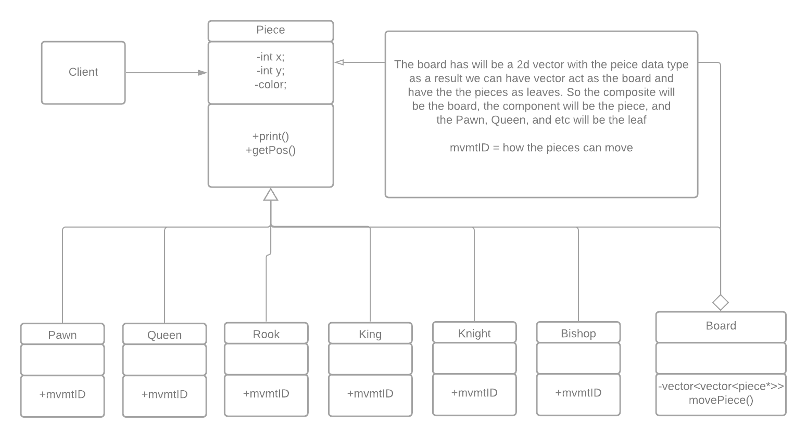
 
 > ## Strategy
 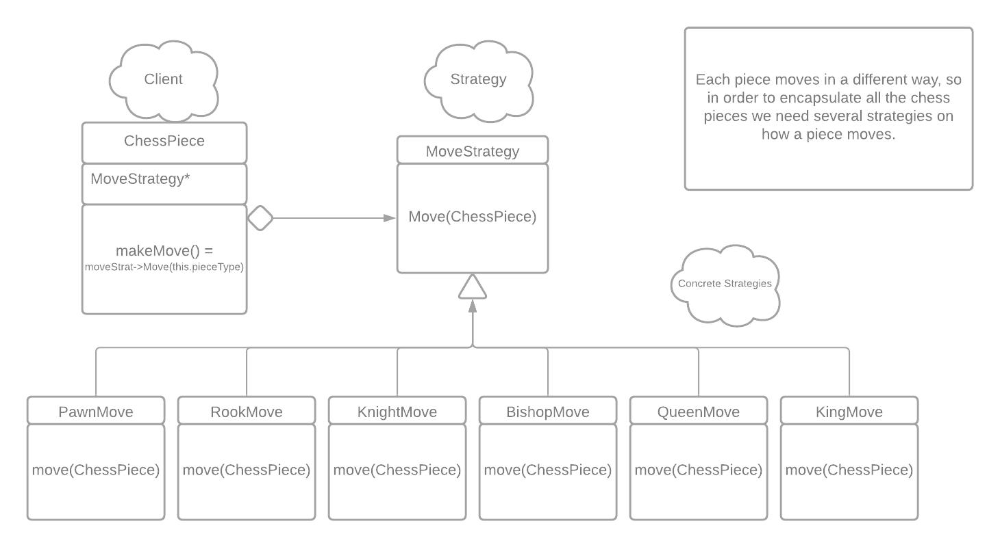
 
 > ## Singleton
 > We create an instance of the board. The contructor of the board is privated because we don't need more than one intiailization of the board. We have a getter in order to return the state of our board without calling reference everytime.
 
 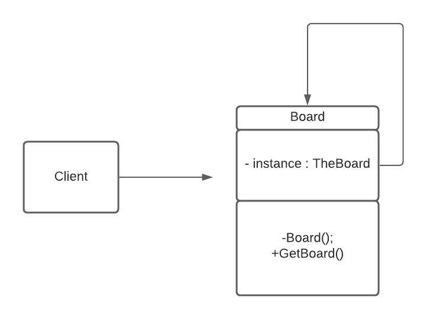

 
 > ## Phase III
 > You will need to schedule a check-in with the TA (during lab hours or office hours). Your entire team must be present. 
 > * Before the meeting you should perform a sprint plan like you did in Phase II
 > * In the meeting with your TA you will discuss: 
 >   - How effective your last sprint was (each member should talk about what they did)
 >   - Any tasks that did not get completed last sprint, and how you took them into consideration for this sprint
 >   - Any bugs you've identified and created issues for during the sprint. Do you plan on fixing them in the next sprint or are they lower priority?
 >   - What tasks you are planning for this next sprint.

 > ## Final deliverable
 > All group members will give a demo to the TA during lab time. The TA will check the demo and the project GitHub repository and ask a few questions to all the team members. 
 > Before the demo, you should do the following:
 > * Complete the sections below (i.e. Screenshots, Installation/Usage, Testing)
 > * Plan one more sprint (that you will not necessarily complete before the end of the quarter). Your In-progress and In-testing columns should be empty (you are not doing more work currently) but your TODO column should have a full sprint plan in it as you have done before. This should include any known bugs (there should be some) or new features you would like to add. These should appear as issues/cards on your Kanban board. 
 ## Screenshots

 ## Installation/Usage
  > To start the game, run the code through the terminal.
 > ## Start of Game
 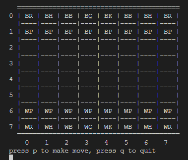
 >
 > ## User Prompt
 > Terminal will prompt user for input to select their chess piece. Then it will ask for confirmation if
 > user wants to move chess piece or that user want to switch.
 >
 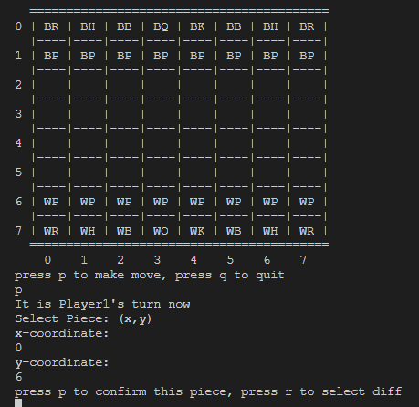
 >
 > ## Single Move
 > To demonstrate game is a simple pawn movement from (0,6) to (0,4)
 >
 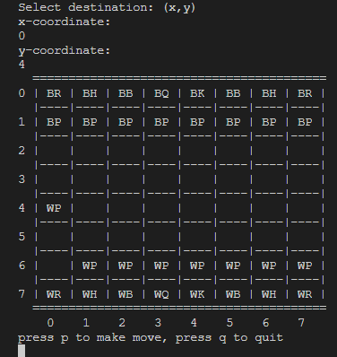
 >
 > ## More Moves
 > To demonstrate more complex gameplay.
 >
 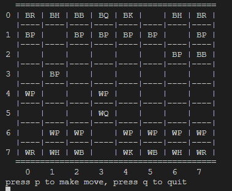
 >
 > ## Attack
 > How user will 'attack' other piece.
 >
 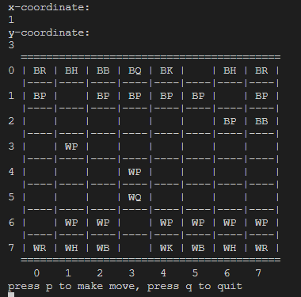
 >
 > ## Check and win condition 
 > When one side checks the other king, they claim victory
 >
 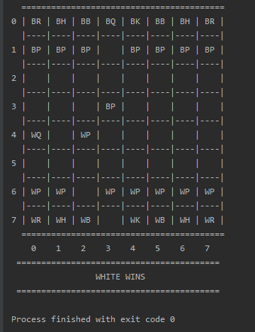
 ## Testing
 > How was your project tested/validated? If you used CI, you should have a "build passing" badge in this README.
 > * The project was tested with GTEST. Using GTEST, the project tested:
 >     - To ensure all pieces were placed on their correct location.
 >     - Make sure each pieces' movement correspond with the rule 
 >     - To make sure that no pieces are allow to make illegal moves
 >     - Confirm that pieces are not allow to attack allies
 >     - Confirm that pieces are allow to attack enemy pieces
 
 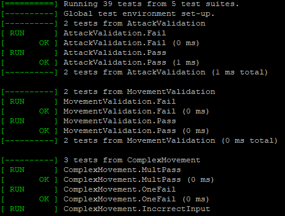
 >
 >
 >
 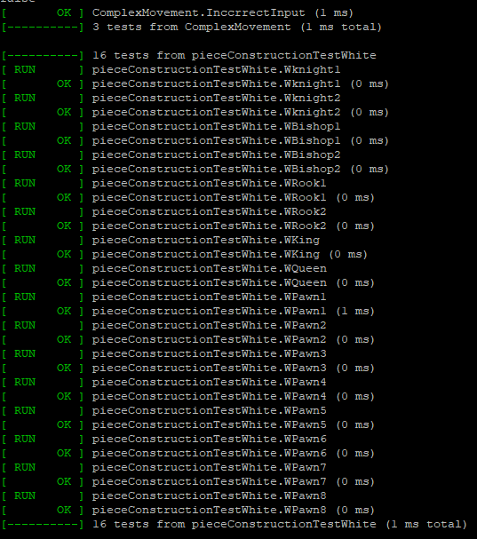
 >
 >
 >
 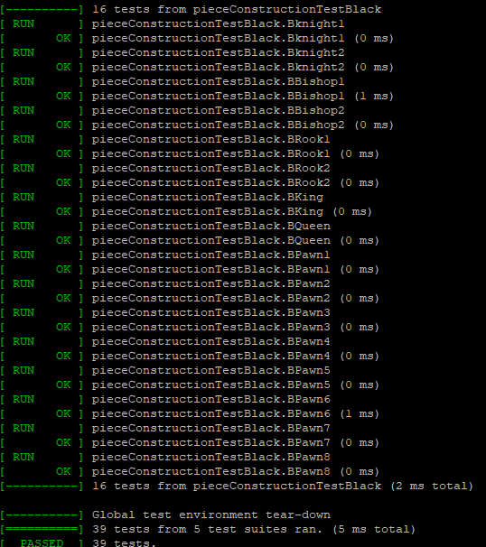
 
